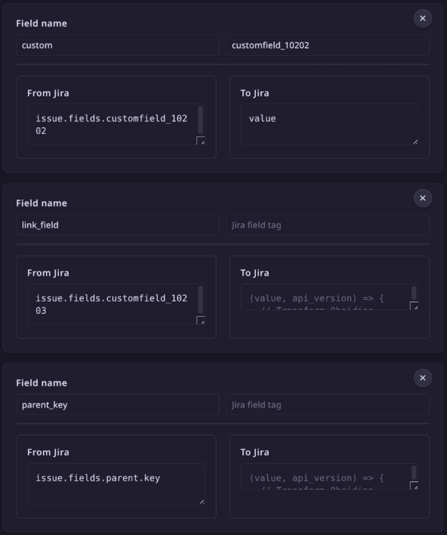

# Jira Issue Manager

A two-way Jira synchronization plugin for Obsidian. Templates, custom field mapping, time tracking, and batch operations — all without leaving your notes.

[demo_video.mp4](docs/images/demo_video.mp4)

## Features

- **Full two-way sync** — fetch issues from Jira, edit in Obsidian, push changes back
- **Custom templates** — structure your issue notes however you want using `jira-sync-section`, `jira-sync-line`, and `jira-sync-inline` markers that are hidden from view
- **Deep field mapping** — sync any Jira field, including custom fields from ScriptRunner, Insight, and other add-ons. Built-in mappings for 15+ standard fields, with support for custom JavaScript transform functions
- **Time tracking** — built-in work log statistics and batch submission. Supports Timekeep and Super Simple Time Tracker formats
- **Status management** — transition issues through workflows directly from Obsidian
- **Multiple authentication methods** — Bearer Token (PAT), Basic Auth, or Session Cookie
- **Multi-connection support** — work with multiple Jira instances
- **JQL search and batch fetch** — find and pull in issues by query
- **Inline comments** — add comments to Jira issues with text selection support

## Quick start

1. Install from Community Plugins → search "Jira Issue Manager"
2. Open Settings → configure Jira URL and authentication
3. Use `Get issue from Jira with custom key` from the command palette
4. Edit your note — changes sync back with `Update issue in Jira`

## Documentation

- [English guide](docs/how_to_en.md)
- [Russian guide](docs/how_to_ru.md)
- [Template examples](docs/template_example.md)

## Why this one?

Most Jira plugins for Obsidian treat issues as read-only. This one is built for people who want to work _in_ Obsidian and push changes back to Jira. Key differentiators:

- True two-way synchronization (not just display)
- Support for arbitrary custom fields with programmable mapping
- Integrated time tracking and batch work log submission
- No external dependencies for statistics or time tracking
- Markers are hidden in both Live Preview and Reading mode

## License

MIT — originally forked from [obsidian-to-jira](https://github.com/angelperezasenjo/obsidian-to-jira).
