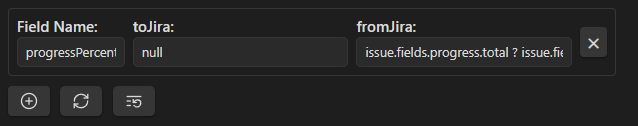

The functionality of the plugin can be divided into several parts.

### Basic Functionality
For basic functionality, it is enough to specify Jira credentials (username, password, URL) and the folder for created tasks.

When running `Get issues from Jira with custom key`, the command will download the latest tasks from Jira and save them in the specified folder.

Without a template, such a page will be completely empty except for its title, so using a template is highly recommended. The template is used only when creating a new page.

#### Template
The template can consist of several different parts:
1. **formatter** - meta-information at the top of the screen. When specifying keys for it and using any `Get issues from Jira` variant, they will be populated with corresponding fields from the response data.
2. **body** - the main content of the page. When using indicators like `jira-sync-section-*` or `jira-sync-line-*`, they will be filled with the corresponding fields from the response data. The difference between these two options is as follows: `line` reads and writes values from the current line, separating the indicator and value with a space. `section` reads values from multiple lines after the indicator, stopping only at another indicator or a heading. An example can be found in [[docs/template_example.md]].

It is highly recommended to specify basic values in the template's formatter: `key` - the Jira task ID used for updates, `summary` - the Jira task title, and `status` - the current status of the task in Jira.

The body takes priority and will overwrite formatter values when updating a task in Jira if a field's value is present in both sections.

Not all fields are predefined, and some may need adjustments. For example, the template provided in [[docs/template_example.md]] will not correctly retrieve `progressPercent` and `creator` from Jira, even though these fields exist. To fix this, refer to the advanced usage section below.

### Commands

Currently, the plugin provides the following commands:
- `Get issue from Jira with custom key` - allows creating a file in the configured folder that imports information from Jira using a manually specified ID.
- `Get issue from Jira` - allows updating the active file if its formatter contains a `key` (the Jira task ID).
- `Update issue from Jira` - allows updating the information from the file in Jira using the key specified in the formatter. Some system fields (e.g., `status`) cannot be changed this way and have dedicated commands.
- `Create issue from Jira` - allows creating a new task in Jira. The formatter must include `summary` (task title) and optionally `project` and `issuetype` (the latter two can be selected from existing options during creation).
- `Update work log in Jira` - enables tracking time spent on a task. Currently, this is not reflected in the file, but it will be available in future updates. If the formatter contains `jira_selected_week_data` (as described in [[docs/jira_selected_week_data.md]]), instead of manual entry, a batch of data from `jira_selected_week_data` will be sent, updating each listed entity.
- `Update issue status in Jira` - allows updating a task's status by selecting one of the available options.

### Advanced Usage

#### Field Mapping
In the settings, you can configure custom mapping for any additional fields received from Jira. To do this:
- Configure how information is sent to Jira (e.g., with the `null` function, the field will be ignored).
- Define how it is received from Jira (e.g., `issue.fields.creator.name` will retrieve the creator's name instead of the entire object with related data).

Similarly, you can configure the `progressPercentage` shown in the example. This field does not exist in the response, but it can be "assembled" from the existing `progress` field: `issue.fields.progress.total ? 100 * issue.fields.progress.progress / issue.fields.progress.total : 0`. As seen in the syntax, mapping uses a simplified TypeScript format.

It will look something like this:



#### Statistics
This is a pre-configured file [[docs/statistics.md]]. To work with it, several additional plugins are required:
- **Timekeep** for tracking time spent on tasks - each task can have a multi-level timer started, stopped, and edited.
- **Dataview** with JavaScript queries enabled in settings to create a dynamic table of total time spent over the last few weeks.
- **Meta Bind** for selecting the desired week and submitting work data for the week with a single button.

As mentioned, the statistics page allows sending a batch of work data for the target week, reducing manual input time.

With Obsidian themes disabled, the table looks like this:


The data batch format for submission, if you want to create an alternative [[docs/statistics.md]] variant:
```json
{
  "type": "array",
  "items": {
    "type": "object",
    "properties": {
      "issueKey": {
        "type": "string",
        "pattern": "^[A-Z]+-\d+$",
        "description": "Task key in the Jira system"
      },
      "startTime": {
        "type": "string",
        "format": "date-time",
        "description": "Start time in DD-MM-YYYY HH:MM format"
      },
      "duration": {
        "type": "string",
        "description": "Task duration in hours"
      },
      "comment": {
        "type": "string",
        "description": "Job description"
      }
    },
    "required": ["issueKey", "startTime", "duration"]
  }
}
```
Example:

```json
[
    {
        "file": "Develop new Obsidian plugin",
        "issueKey": "JIR-2",
        "blockPath": "Deployment & Documentation > Publishing on Obsidian Marketplace",
        "startTime": "17-03-2025 17:00",
        "endTime": "17-03-2025 21:00",
        "duration": "4h"
    },
    {
        "file": "Develop new Obsidian plugin",
        "issueKey": "JIR-2",
        "blockPath": "Deployment & Documentation > Writing Documentation",
        "startTime": "18-03-2025 12:00",
        "endTime": "18-03-2025 21:00",
        "duration": "9h"
    }
]
```
