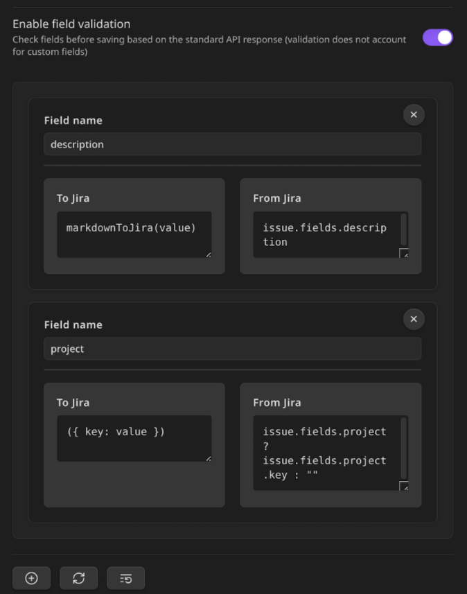

The functionality of the plugin can be divided into several parts.

### Basic Functionality
For basic functionality, it is enough to specify Jira credentials and the folder for created tasks.

**Authentication Methods**
The plugin supports three authentication methods:
- **Bearer Token (PAT)** - Personal Access Token authentication
- **Basic Auth (Username + PAT)** - Username with Personal Access Token
- **Session Cookie (Username + Password)** - Traditional username and password authentication

**Important Note for Auth Keys**: If using Personal Access Token authentication, the `write:jira-work` and `read:jira-work` scopes are essential for the plugin to function properly.

When running `Get issue from Jira with custom key`, the command will download the latest tasks from Jira and save them in the specified folder.

Without a template, such a page will be completely empty except for its title, so using a template is highly recommended. The template is used only when creating a new page.

#### Template
The template can consist of several different parts:

##### Frontmatter
Meta-information at the top of the screen. When specifying keys for it and using any `Get issues from Jira` variant, they will be populated with corresponding fields from the response data.

##### Body
The main content of the page. When using indicators like `jira-sync-"type"-*`, they will be filled with the corresponding fields from the response data. 

The difference between these options is as follows: 

- `line` reads and writes values from the current line. 

Example:
```md
The responsible person for this task is `jira-sync-line-assignee` Bob
The description is `jira-sync-line-description` Some description
```
- `section` reads values from multiple lines after the indicator, stopping only at any other indicator or a heading.

Example:
```md
### Responsible `jira-sync-section-assignee`
Bob
### Description `jira-sync-section-description`
Some description
`jira-sync-section-customfield_10842`
...
```
- `inline` allows indicator of start and end to be placed anywhere in the text. Must have an ending part of indicator (`jira-sync-end`).

Example:
```md
The responsible person for this task is `jira-sync-inline-start-assignee`Bob`jira-sync-end`, and the description is `jira-sync-inline-start-description`Some description`jira-sync-end`.
```
- `block` is basically the same as `inline`, but with line break before and after indicators.

Example:
```md
The responsible person for this task is `jira-sync-block-assignee`
Bob
`jira-sync-end`, and the description is `jira-sync-block-description`
Some description
`jira-sync-end`.
```

An example can be found in [[docs/template_example]].

It is highly recommended to specify the following basic values in the template's formatter: `key` - the Jira task ID used for updates, `summary` - the Jira task title, and `status` - the current status of the task in Jira.

The formatter takes priority and will overwrite file content values when updating a task in Jira if a field's value is present in both as formatter saves initial format of value and when putting it in body we parse it to string.

Not all fields are predefined, and some may need adjustments. To add any custom nonusual fields, features of their representation in .md format and how to update their info in Jira, refer to the advanced usage section below.

### Commands

Currently, the plugin provides the following commands:
- `Get issue from Jira with custom key` - allows creating a file in the configured folder that imports information from Jira using a manually specified ID.
- `Batch Fetch Issues by JQL` - allows mass issue import from Jira using a JQL query.
- `Get current issue from Jira` - allows updating the active file if its formatter contains a `key` (the Jira task ID).
- `Update issue in Jira` - allows updating the information from the file in Jira using the key specified in the formatter. Some system fields (e.g., `status`) cannot be changed this way and have dedicated commands.
- `Create issue in Jira` - allows creating a new task in Jira. The formatter must include `summary` (task title) and optionally `project` and `issuetype` (the latter two can be selected from existing options during creation).
- `Update work log in Jira manually` - enables manual time tracking for a task. Currently, this is not reflected in the file, but it will be available in future updates.
- `Update work log in Jira by batch` - enables batch time tracking. If the formatter contains `jira_worklog_batch`, a batch of data from `jira_worklog_batch` will be sent, updating each listed entity.
- `Update issue status in Jira` - allows updating a task's status by selecting one of the available options.

### Advanced Usage

#### Field Mapping
In the settings, you can configure custom mapping for any additional fields received from Jira. To do this:
- Configure how information is sent to Jira (e.g., with the `null` function, the field will be ignored).
- Define how it is received from Jira (e.g., `issue.fields.creator.name` will retrieve the creator's name instead of the entire object with related data).

Similarly, you can configure the `progressPercentage` shown in the example. This field does not exist in the response, but it can be "assembled" from the existing `progress` field: `issue.fields.progress.total ? 100 * issue.fields.progress.progress / issue.fields.progress.total : 0`. As seen in the syntax, mapping uses a simplified TypeScript format.

Additionally, you can use some of the built-in functions:
- `jiraToMarkdown` - converts Jira markup to Markdown.
- `markdownToJira` - converts Markdown to Jira markup.
- `JSON.parse` - converts a JSON string to an object.
- `JSON.stringify` - converts an object to a JSON string.

and modules: (original Javascript syntax)
- `Math` - provides access to mathematical functions, such as `Math.round()`.
- `Date` - provides access to date functions, such as `Date.now()`.
- `String` - provides access to string functions, such as `String.fromCharCode()`.
- `Number` - provides access to number functions, such as `Number.isNaN()`.
- `Boolean` - provides access to boolean functions, such as `Boolean(true)`.
- `Array` - provides access to array functions, such as `Array.isArray()`.
- `Object` - provides access to object functions, such as `Object.keys()`.

Field mapping can like this:



#### Statistics
Statistics are now integrated into the plugin and can be accessed through the plugin settings in the "Timekeep work log statistics" section. This feature provides a dynamically generated table (or series of tables) showing work statistics and allowing you to send work logs to Jira. You can conveniently select time periods for calculation and transfer work log information to Jira directly from the settings interface.

The table looks like this:


