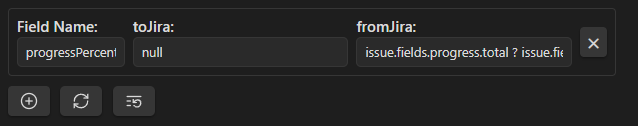

Функционал плагина можно разделить на несколько частей.

### Базовый функционал
Для него достаточно указать креды Jira и папку с создаваемыми задачами.

**Методы аутентификации**
Плагин поддерживает три метода аутентификации:
- **Bearer Token (PAT)** - аутентификация по персональному токену доступа
- **Basic Auth (Username + PAT)** - имя пользователя с персональным токеном доступа
- **Session Cookie (Username + Password)** - традиционная аутентификация по имени пользователя и паролю

**Важное замечание для ключей аутентификации**: При использовании аутентификации по персональному токену доступа, области `write:jira-work` и `read:jira-work` являются обязательными для корректной работы плагина.

При запуске `Get issue from Jira with custom key` команда будет скачивать актуальные задачи из Jira и сохранять их в указанной папке.

Без шаблона такая страничка будет полностью пустой за исключением её названия, так что шаблон настоятельно рекомендуется к использованию. Шаблон используется только при создании новой страницы.

#### Шаблон
Шаблон можно составить из нескольких разных частей:
1. **formatter** - он же метаинформация сверху экрана. При указании ключей для него и любом варианте `Get issues from Jira` они будут заполняться соответствующими полями из ответных данных.
2. **body** - основное содержимое страницы. При написании указателя вида `jira-sync-section-*`, `jira-sync-line-*` или `jira-sync-inline-start-*` они будут заполняться соответствующими полями из ответных данных. Разница между этими вариантами в следующем: `line` читает и пишет значение из текущей строки, разделяя указатель и значение пробелом. `section` читает значение из ряда строк после указателя, останавливаясь только при другом указателе или заголовке. `inline` позволяет индикаторам располагаться где угодно, а не строго в начале строки. Все индикаторы являются невидимыми пока не выделишь их мышкой, обеспечивая более чистый опыт редактирования.

Пример можно посмотреть в [[docs/template_example]]

Настоятельно рекомендуется указать в formatter шаблоона базовые значения: `key` - id задачи в Jira, по которому производится обновление, `summary` - название задачи в Jira, `status` - текущий статус задачи в Jira.

formatter имеет приоритет и будет перезаписывать значения body, если значения для одного поля имеются в обоих местах, так как formatter сохраняет изначальный тип переменной, а body конвертирует её в string.

Не все поля прописаны заранее и некоторые могут нуждаться в доработке. Пример предоставленный в [[docs/template_example]] например, не сможет подтянуть корректно `progressPercent` и `creator` из Jira, хотя такие поля существуют. Чтобы это исправить, нужно отбратиться к разделу продвинутого использования ниже.

### Команды

На текущий момент плагин предоставляет следующие команды:
- `Get issue from Jira with custom key` - позволяет создать в папке, указанной в настройках, файл, импортирующий информацию из Jira по указанному вручную id.
- `Batch Fetch Issues by JQL` - позволяет получить задачи по JQL и создать/обновить все соответствующие заметки.
- `Get current issue from Jira` - позволяет обновить активный файл, если в его formatter указан key - id задачи Jira.
- `Update issue in Jira` - позволяет обновить информацию из файла в Jira по указанному в formatter ключу. Ряд системных полей (например, `status`, таким образом изменить нельзя. Для них созданы отдельные команды)
- `Create issue in Jira` - позволяет создать в Jira новую задачу. В formatter обязательно нужно указать summary - название задачи и, опционально, `project` и `issuetype` (последние два можно выбрать из существующих при создании)
- `Update work log in Jira manually` - позволяет вести учёт потраченного на задачу времени вручную. В данный момент он никак не отображается в файле, это будет в ближайших обновлениях.
- `Update work log in Jira by batch` - позволяет вести учёт потраченного на задачу времени батчем. Если в файле в formatter есть `jira_worklog_batch`, то вместо ручного заполнения будет послан батч данных из `jira_worklog_batch` с обновлением каждой из представленных сущностей.
- `Update issue status in Jira` - позволяет обновить статус задачи, выбрав один из возможных вариантов.

### Продвинутое использование

#### Маппинг полей
В настройках можно задать кастомный маппинг дл любых дополнительных полей, приходящих из запроса. Для этого нужно:
- Настроить в каком виде информация отправляется в Jira (например при функции `null` поле будет игнорироваться)
- В каком виде получается из Jira (например `issue.fields.creator.name` позволит получать соответственное имя создателя запроса, а не весь объект с информацией о нём в целом.)

Таким же образом можно настроить показанный в примере `progressPercentage` - такого поля в запросе не существует, но его можно 'собрать' из существующего `progress`: `issue.fields.progress.total ? 100 * issue.fields.progress.progress / issue.fields.progress.total : 0`. Как понятно из синтаксиса, для маппинга используется обрезанный TypeScript

Будет это выглядеть примерно так: 

#### Статистика
Статистика теперь интегрирована в плагин и доступна через настройки плагина в секции "Timekeep work log statistics" ("Статистика ведения журнала работы через Timekeep"). Эта функция предоставляет динамически генерируемую таблицу (или ряд таблиц), показывающую статистику работы и позволяющую отправлять журналы работ в Jira. Там же можно удобно выбирать временные промежутки для которых проводится расчёт и передавать информацию ведения журнала работы в Jira.

Выглядит табличка с выключенными темами Обсидиана примерно так: 

 

### Настройки плагина

#### Connection Settings
Эта секция позволяет выбрать метод аутентификации и ввести соответствующие креды. Плагин поддерживает три метода аутентификации: Bearer Token (PAT), Basic Auth (Username + PAT) и Session Cookie (Username + Password). При использовании аутентификации по персональному токену доступа убедитесь, что области `write:jira-work` и `read:jira-work` включены для корректной работы.

#### General Settings
Эта секция позволяет выбрать папку, где будут храниться новые issues созданные с помощью команд. Эта папка также используется для поиска issues в разделе Timekeep work log statistics.

#### Field Mapping
Эта секция предоставляет нестандартные маппинги (в JavaScript формате) информации из Jira в Obsidian и обратно. Вы можете настроить кастомные трансформации полей и маппинги для любых дополнительных полей, получаемых из Jira.

#### Raw Issue Viewer
Эта секция отображает сырой вывод API для введённых issues, что должно помочь с написанием маппингов полей. Эти данные не сохраняются и предоставляются для отладки и разработки.

#### Test Field Mapping
Эта секция предоставляет предпоказ результатов маппинга для issues из raw issue viewer. Эта функция помогает с тестированием и улучшением маппингов полей. Данные не сохраняются и предоставляются для удобства при работе с маппингами.

#### Timekeep Work Log Statistics
Эта секция предоставляет динамически генерируемую таблицу (или ряд таблиц, см. изображение), показывающую статистику работы и дающую возможность отправить журнал работ в Jira. Вы можете выбирать временные промежутки для расчёта и передавать информацию ведения журнала работы в Jira прямо из этого интерфейса.
