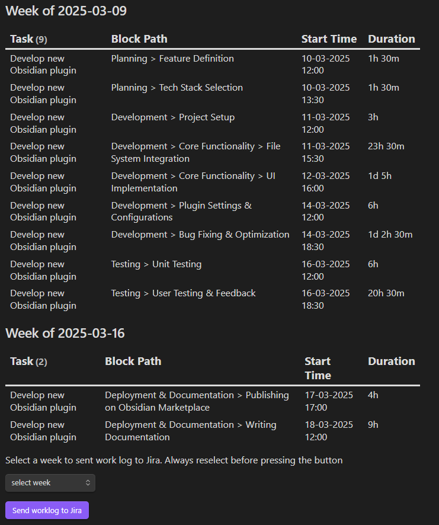

Функционал плагина можно разделить на несколько частей.

### Базовый функционал
Для него достаточно указать креды Jira (username, password, URL) и папку с создаваемыми задачами.

При запуске `Get issues from Jira with custom key` команда будет скачивать актуальные задачи из Jira и сохранять их в указанную папку.

Без шаблона такая страничка будет полностью пустой за исключением её названия, так что шаблон настоятельно рекомендуется к использованию. Шаблон используется только при создании новой страницы.

#### Шаблон
Шаблон можно составить из нескольких разных частей:
1. **formatter** - он же метаинформация сверху экрана. При указании ключей для него и любом варианте `Get issues from Jira` они будут заполняться соответствующими полями из ответных данных.
2. **body** - основное содержимое страницы. При написании указателя вида `jira-sync-section-*` или `jira-sync-line-*` они будут заполняться соответствующими полями из ответных данных. Разница между этими двумя вариантами в следующем: `line` читает и пишет значение из текущей строки, разделяя указатель и значение пробелом. `section` читает значение из ряда строк после указателя, останавливаясь только при другом указателе или заголовке. Пример можно посмотреть в [[docs/template_example]]

Настоятельно рекомендуется указать в formatter шаблоона базовые значения: `key` - id задачи в Jira, по которому производится обновление, `summary` - название задачи в Jira, `status` - текущий статус задачи в Jira.

formatter имеет приоритет и будет перезаписывать значения body, если значения для одного поля имеются в обоих местах, так как formatter сохраняет изначальный тип переменной, а body конвертирует её в string.

Не все поля прописаны заранее и некоторые могут нуждаться в доработке. Пример предоставленный в [[docs/template_example]] например, не сможет подтянуть корректно `progressPercent` и `creator` из Jira, хотя такие поля существуют. Чтобы это исправить, нужно отбратиться к разделу продвинутого использования ниже.

### Команды

На текущий момент плагин предоставляет следующие команды:
- `Get issue from Jira with custom key` - позволяет создать в папке, указанной в настройках, файл, импортирующий информацию из Jira по указанному вручную id.
- `Get issue from Jira` - позволяет обновить активный файл, если в его formatter указан key - id задачи Jira.
- `Update issue from Jira` - позволяет обновить информацию из файла в Jira по указанному в formatter ключу. Ряд системных полей (например, `status`, таким образом изменить нельзя. Для них созданы отдельные команды)
- `Create issue from Jira` - позволяет создать в Jira новую задачу. В formatter обязательно нужно указать summary - название задачи и, опционально, `project` и `issuetype` (последние два можно выбрать из существующих при создании)
- `Update work log in Jira` - позволяет вести учёт потраченного на задачу времени. В данный момент он никак не отображается в файле, это будет в ближайших обновлениях. Если в файле в formatter есть `jira_selected_week_data` (как это в [[docs/jira_selected_week_data]]), то вместо ручного заполнения будет послан батч данных из `jira_selected_week_data` с обновлением каждой из представленных сущностей.
- `Update issue status in Jira` - позволяет обновить статус задачи, выбрав один из возможных вариантов.

### Продвинутое использование

#### Маппинг полей
В настройках можно задать кастомный маппинг дл любых дополнительных полей, приходящих из запроса. Для этого нужно:
- Настроить в каком виде информация отправляется в Jira (например при функции `null` поле будет игнорироваться)
- В каком виде получается из Jira (например `issue.fields.creator.name` позволит получать соответственное имя создателя запроса, а не весь объект с информацией о нём в целом.)

Таким же образом можно настроить показанный в примере `progressPercentage` - такого поля в запросе не существует, но его можно 'собрать' из существующего `progress`: `issue.fields.progress.total ? 100 * issue.fields.progress.progress / issue.fields.progress.total : 0`. Как понятно из синтаксиса, для маппинга используется обрезанный TypeScript

Будет это выглядеть примерно так: 


#### Статистика
Это предзаготовленный файл [[docs/statistics]]. Для работы с ним потребуется несколько дополнительных плагинов: 
- **Timekeep** для ведения времени работы с задачами - в каждой задаче можно запускать, останавливать и редактировать многоуровневый таймер; 
- **Dataview** с включенным в настройках JavaScript queries для создания динамичной таблички всего потраченного времени за последние пару недель;
- **Meta Bind** для выбора нужной недели и отправки данных о работе за неделю одной кнопкой.

Как было написано, страница статистики позволяет отправить сразу батч данных о работе за целевую неделю, сокращая время для ручного труда.

Выглядит табличка с выключенными темами Обсидиана примерно так: 

 

Формат батча данных для отправки данных если захочется сделать альтернативный [[docs/statistics]] вариант:
```json
{
  "type": "array",
  "items": {
    "type": "object",
    "properties": {
      "issueKey": {
        "type": "string",
        "pattern": "^[A-Z]+-\\d+$",
        "description": "Ключ задачи в системе Jira"
      },
      "startTime": {
        "type": "string",
        "format": "date-time",
        "description": "Время начала в формате DD-MM-YYYY HH:MM"
      },
      "duration": {
        "type": "string",
        "description": "Продолжительность задачи в неделях (w), днях (d), часах (h), минутах (m)"
      }, 
	  "comment": {
		"type": "string",
		"description": "описание проделанной работы"
	  }
    },
    "required": ["issueKey", "startTime", "duration"]
  }
}
```
Пример:
```json
[
	{
		"issueKey": "JIR-2",
		"startTime": "17-03-2025 17:00",
		"duration": "1h 5m"
	},
	{
		"issueKey": "JIR-2",
		"startTime": "18-03-2025 12:00",
		"duration": "1w 5d",
		"comment": "Подобная продолжительность не будет отражена в статистике, так как подразумевается срабатывание лишь раз в неделю, но вы можете изменить [[docs/statistics]], например, на срабатывание раз в месяц"
	}
]
```
